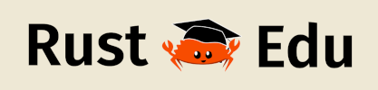
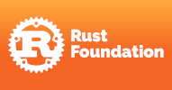

# Teach-rs

Teach-rs est un cours universitaire destiné aux étudiants en informatique, introduisant le langage de programmation Rust. Il est également accessible à tous ceux qui souhaitent enseigner Rust.

Pourquoi ? Consultez notre [article de blog](https://tweedegolf.nl/en/blog/127/want-more-rust-break-the-cycle) pour découvrir l'objectif du cours.

Ce dépôt contient tout ce qui est nécessaire pour organiser le cours : diapositives, exercices, outils, instructions de configuration et plus encore.

*Bien que tout le matériel disponible soit prêt à l'emploi, ce dépôt n'est pas encore aussi exhaustif que nous le souhaiterions. Vos retours et [contributions](./CONTRIBUTING.md) sont donc les bienvenus ! Nous acceptons également les parrainages ; lisez-en plus ci-dessous ou sur notre [page de parrainage](https://github.com/sponsors/trifectatechfoundation).*

**Besoin d'aide ? Des questions ? Venez discuter sur notre canal Matrix : **

## Utilisation
Le guide de l'enseignant est disponible [ici](./teachers_guide.md).  
Consultez le [README ModMod](./modmod/README.md) pour les instructions sur le rendu du contenu d'une piste.

## Structure
Le contenu se trouve dans le répertoire [`content`](./content).  
Il est structuré en un arbre de Pistes, Modules, Unités et Sujets.  
- **Pistes** : définissent un cours complet, composé de plusieurs modules.  
- **Modules** : regroupent des unités liées entre elles.  
- **Unités** : correspondent généralement à une leçon + tutoriel et sont constituées de plusieurs sujets.  
- **Sujets** : couvrent un thème unique et comprennent des diapositives, des exercices et une description des exercices.  

Les Pistes, Modules, Unités, Sujets et les fichiers associés sont décrits dans plusieurs fichiers TOML dans le répertoire [`content`](./content).  
[ModMod](./modmod/README.md) combine le contenu en une structure directement publiable, par exemple dans un dépôt Git destiné aux étudiants.

## Pistes prédéfinies
- [Introduction au langage Rust](./content/rust-intro.track.toml) : introduction aux bases du langage Rust, pour permettre aux étudiants de développer leurs propres applications et crates.
- [Rust pour le Web](./content/rust-for-web.track.toml) : contenu nécessaire pour utiliser Rust dans des applications web.
- [Rust pour la programmation système](./content/rust-for-systems.track.toml) : sujets bas niveau pour enseigner la programmation système avec Rust.
- [Rust scientifique](./content/scientific-rust.track.toml) : utilisation de Rust dans la programmation scientifique.
- [Complet](./content/full.track.toml) : inclut tout le contenu disponible de teach-rs.

*Note : bien que les plans des pistes soient presque terminés, elles peuvent encore contenir des TODOs. N'hésitez pas à contribuer pour enrichir le contenu !*

## Objectifs généraux
Teach-rs vise à fournir un cours open-source, comprenant des conférences, tutoriels et exercices, utilisable par toute institution d'enseignement supérieur.  
Utilisez une des pistes prédéfinies ou composez la vôtre avec le contenu proposé et vos propres ressources.

1. Fournir une base modulaire et réutilisable pour des cours Rust en présentiel.  
2. Offrir une expérience pratique et concrète aux étudiants.  
3. Fournir des informations de fond sur les fonctionnalités de Rust.  
4. Aider les étudiants à évaluer l'adéquation de Rust à leurs projets.  
5. Proposer plusieurs pistes spécialisées axées sur différentes applications (systèmes, embarqué, web, etc.).  
6. Permettre aux enseignants de contribuer leur matériel pour qu'il soit utile à d'autres.

## Contribuer
Si vous souhaitez améliorer teach-rs, que ce soit en retouchant, restructurant un module ou en ajoutant un nouveau module, veuillez consulter les [directives de contribution](./CONTRIBUTING.md) avant de commencer.

## À propos du projet

Le projet a été créé par [Tweede golf](https://tweedegolf.nl) et est maintenant maintenu par la [Trifecta Tech Foundation](https://trifectatech.org).

### Nos sponsors

#### Sponsors fondateurs

Le sponsor initial du projet est la Faculté d'informatique et des technologies de l'information (FIIT) de l'Université technique slovaque (STU) à Bratislava, Slovaquie. La contribution de [FIIT](https://www.fiit.stuba.sk/en.html?page_id=749) a permis de poser les bases du cours. [Tweede golf](https://tweedegolf.nl/en) et [Rust Edu](https://rust-edu.org/) ont également grandement contribué à la création de teach-rs.  

De plus, l'un de nos mainteneurs, [@hdoordt](https://github.com/hdoordt), a reçu une subvention de la [Rust Foundation](https://foundation.rust-lang.org/).

#### Sponsors argent

Un grand merci à nos sponsors argent :  

- [Gofore](https://gofore.com/en/)  
- [RustJobs.dev](https://rustjobs.dev/)  

### Soutenir teach-rs

Contactez-nous si vous êtes intéressé par un soutien financier pour la maintenance et le développement des ressources teach-rs. Consultez [trifectatech.org/support](https://trifectatech.org/support/).  
Vous pouvez également parrainer notre travail via [GitHub sponsors](https://github.com/sponsors/trifectatechfoundation).
